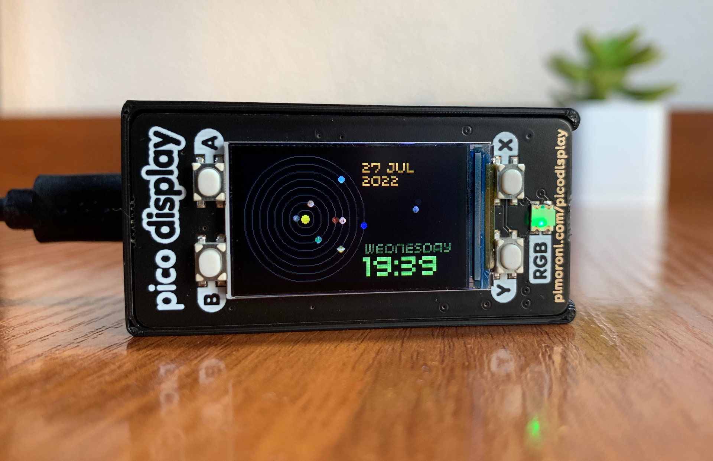

# Pico Solar System for T-PicoC3

A miniature device depicting the relative position of the planets in Solar System.

This port is thought to work for the [T-PicoC3 from LILYGO](https://github.com/Xinyuan-LilyGO/T-PicoC3).



### Hardware
* LilyGO T-PicoC3
* optional a Precision RTC Module (DS3231)


### Software
#### MicroPython
The software is written in MicroPython and uses a custom build which includes drivers for the display.
I got my build from [this repository](https://github.com/russhughes/st7789_mpy), a ready-to-use UF2 file can be found [here](https://github.com/russhughes/st7789_mpy/raw/master/firmware/T-DISPLAY-RP2040/firmware.uf2).


1. Download the MicroPython UF2.
2. Push and hold the BOOT button and plug your PicoC3 into the USB port of your computer. Release the BOOT button after your board is connected.
3. It will mount as a Mass Storage Device called RPI-RP2.
4. Drag and drop the MicroPython UF2 file onto the RPI-RP2 volume. 

**[Remember that the T-PicoC3 is dependent on the orientation of the USB-C](https://github.com/Xinyuan-LilyGO/T-PicoC3#in-type-c-you-can-determine-whether-the-current-connection-is-pico-or-esp32c3-through-positive-and-negative-access)**

#### Firmware for the ESP32-C3
As the T-PicoC3 has a second microcontroller on its board (in perticular an ESP32-C3), we need a working firmware on this chip. 
I used the official one from espressif with AT-commands, binaries and documentation can be found [here](https://docs.espressif.com/projects/esp-at/en/latest/esp32c3/AT_Binary_Lists/ESP32-C3_AT_binaries.html).

#### rshell
To upload and configure your Pico Solar System you will need to install rshell. Make sure you have _pip_ installed.
```
pip3 install rshell
```

#### Installing Pico Solar System
1. Download Pico Solar System
```
git clone https://github.com/DrHangs/pico-solar-system-tpicoc3.git
```
2. Open the directory with the source code
```
cd pico-solar-system-tpicoc3
```
3. (If using Wi-Fi), rename wifi_config_sample.py to wifi_config.py and edit to include your Wi-Fi information

4. Copy required python files to your pico
```
rshell
cp *.py /pyboard/
```
5. (If using RTC) Set time & configure the RTC module 
```
repl

import time
import ds3231
rtc = ds3231.ds3231()
rtc.set_time(time.time())
```
To account for a timezone you might want to apply an offset to the UTC timestamp in seconds:
```
rtc.set_time(time.time() + 60 * 60 * (+ OFFSET_IN_HOURS) )
```

### Case 
I haven't tried to print a case yet, but any case for the Lilygo T-Display could work.   

### Support the project
If you would like to support the original project and keep them caffeinated, you can do it here:

[](https://www.buymeacoffee.com/drmod)
